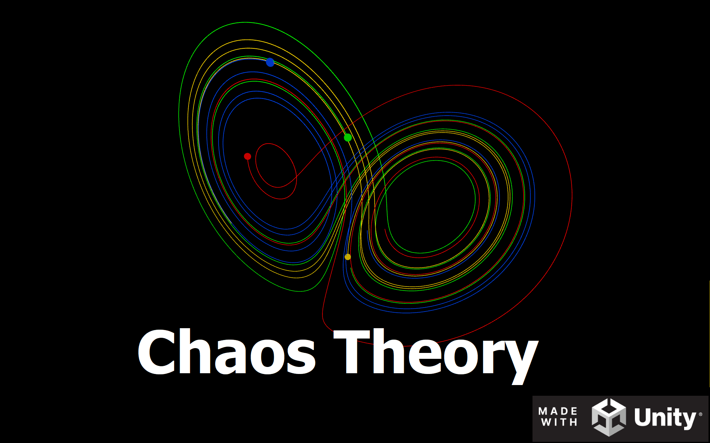

I was lately inspired by a game called exponential idle, where in the late gameplay there is chaos theory related stuff.\
I really liked the idea and i wanted to examine this field a bit more.\
So i created a unity project where tou can play with the parameters of various attractors, and you will see them 'dance' on scrren in 3D\
Of course you can rotate the axis to see the beauty from all possible angles.\
 
Some commentary about what it is capable of and how it was made:\
https://youtu.be/c1m2Mjthhmg

It is available to be played online:\
https://play.unity.com/mg/other/webgl-builds-329535

